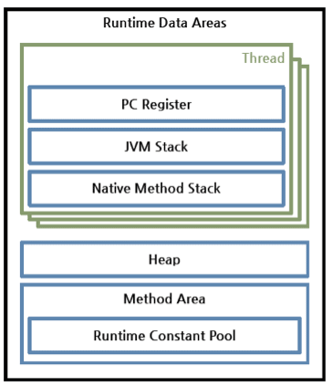
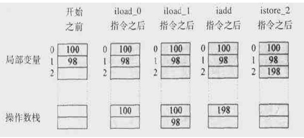
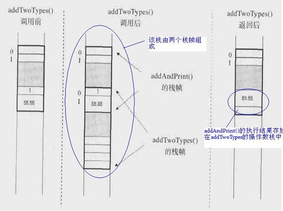

**首先看一下java程序的工作流程** 

> 可以看到我们平常首先会写一个java文件，然后经过java的编译器编译成字节码文件，也就是.class文件，这个过程中我们的程序还没有加载到内存之中。下一步便是通过JRE的类加载器将我们磁盘上的类文件加载到系统分配给JVM的内存区域--运行时数据区(Runtime Data Areas)。然后执行引擎解释或者编译类文件，转化为特定的CPU机器码，CPU执行机器码，至此完成整个过程。

可以发现其中有几个概念， **类加载器**， **运行时数据区** ，**执行引擎** 。这些也都是java虚拟机中的核心概念。下面一一来介绍这些概念。

## 类加载器

**接下来就看一下   *类加载器* 为何物，又是怎么工作的。**

> 层级结构
>
> 类加载器被组织成一种层级结构关系，也就是父子关系。其中，Bootstrap是所有类加载器的父亲。如图所示:

- #### Bootstrap Class Loader:

  > 当运行java虚拟机时，这个类加载器被创建，它加载一些基本的JAVA API，包括Object这个类。需要注意的是，这个类加载器不是用java语言写的，使用C++写的，所以无法访问。

- #### Extension Class Loader:

  > 这个加载器加载出了基本API之外的一些拓展类，包括一些与安全性能想过的类。

- #### System Class Loader:

  > 它加载应用程序中的类，也就是在classpath中配置的类。

- #### User-Defined Class Loader:

  > 这是开发人员通过拓展ClassLoader类定义的自定义加载器，加载程序员定义的一些类。

### **委派模式（Delegation Mode）**

> 仔细看上面的层次结构，当JVM加载一个类的时候，下层的加载器会将任务委托给上一层类加载器，上一层加载检查它的命名空间中是否已经加载这个类，如果已经加载，则直接使用这个类。如果没有加载，则往下找它的子加载器，若它的子类加载器加载了，则直接使用，若没有加载，则往下一直找，若所有类加载器全部找完了后发现都无法加载该类，则报异常。
>
> 对于某个某个特定的类加载器来说，一个java类只能被载入一次，也就是说在Java虚拟机中，类的完整标识是（ClassLoader,package,className）。一个类可以被不同的加载器加载。

> 举个例子来说明，现在假如我有一个自己定义的MyClass需要加载，如果不指定的话，一半交App(System)加载。接到任务后，System检查自己的库里是否已经有这个类，发现没有以后委托给Extension，Extension进行同样的检查，发现还是没有就继续往上委托，最顶层的Boots发现自己的库里也没有，于是根据它的路径(Java核心类库，如java.lang)去尝试加载，没找到这个MyClass类，于是只好往下委托个Extension,Extension到自己的路径（JAVA_HOME/jre/lib/ext）找，还是没有找到，继续往下，此时System加载器到classpath路径寻找，找到了，于是加载到Java虚拟机。
>
> 现在假设我们将这个类放到JAVA_HOME/jre/lib/ext这个路径中去（相当于交给Extension加载器加载），按照同样的规则，最后由Extension加载器加载MyClass类，看到了吧，统一各类被两次加载JVM，但是每次都是由不同的ClassLoader完成。

- 可加性限制

  > 下层的加载器能够看到上层加载器中的类，反之则不行，也就是说委托只能从下到上。

- 不允许卸载类

  > 类加载器可以加载一个类，但是它不能卸载一个类。但是类加载器可以被删除或者被创建。

**当类加载器完毕之后，JVM继续按照如下图完成其他工作：**

框图中各个步骤简单介绍如下：

> - Loading：文章前面介绍的类加载，将文件系统中的Class文件载入到JVM内存（运行数据区域）。
> - Verifying：检查载入的类文件是否符合JAVA规范和虚拟机规范。
> - Preparing：为这个类分配所需要的内存，确定这个类的属性、方法等所需要的数据结构。
> - Resolving：将常量池中的符号引用都改变为直接引用。
> - Initialing：初始化类的局部变量，为静态域赋值，同时执行静态初始化块。

那么，ClassLoader在加载类的时候，究竟做了些什么工作呢？首先必须要介绍一下**运行时数据区域**。

## 运行时数据区域

>  **Runtime Data Areas：**
>
>  当运行一个JVM实例时，系统将分配给它一块内存区域（这块内存区域的大小可以进行设置），这一内存区域由JVM自己来管理。从这一块内存中分出一块用来存储一些运行数据，例如创建的对象，传递给方法的参数，局部变量，返回值等等。分出来的这一块就称为运行数据区域。运行数据区域可以划分为6大块：**Java栈、程序计数寄存器（PC寄存器）、本地方法栈（Native Method Stack）、Java堆、方法区域、运行常量池（Runtime Constant Pool）**。运行常量池本应该属于方法区，但是由于其重要性，JVM规范将其独立出来说明。其中，前面3个区域（PC寄存器、Java栈、本地方法栈）是每个线程独自拥有的，后三者则是整个JVM实例中的所有线程共有的。这六大块如下图所示：

> - PC计数器：
>
>   每一个线程都拥有一个PC计数器，当线程启动时，PC计数器被创建，这个计数器存放当前正在被执行的字节码指令（JVM指令）的地址。
>
> - Java栈：
>
>   同样的，Java栈也是每个线程单独拥有，线程启动时创建。这个栈中存放着一系列的栈帧（Stack Frame），JVM只能进行压入（Push）和弹出（Pop）栈帧这两种操作。每当调用一个方法时，JVM就往栈里压入一个栈帧，方法结束返回时弹出栈帧。如果方法执行时出现异常，可以调用printStackTrace等方法来查看栈的情况，栈的示意图如下：

>  现在我们来详细看看每一个栈帧中都放着什么东西。从示意图很容易看出，每个栈帧包含三个部分：本地变量数组，操作数栈，方法所属类的常量池引用。
>
>  1. 局部（本地）变量数组：
>
>  局部（本地）变量数组中，从0开始按顺序存放方法所属对象的引用、传递给方法的参数、局部变量。举个例子：
>
>  `public void doSomething( int a, double b, Object o){`
>
>  ​	...
>
>  `}`
>
>  这个方法的栈帧中的局部变量存储的内容分别是：
>
>  `0：this` 
>
>  `1：a`
>
>  `2,3：b`
>
>  `4：o `
>
>  看仔细了，其中double类型的b需要两个连续的索引。取值的时候，取出的是2这个索引中的值。如果是静态方法，则数组第0个不存放this引用，而是直接存储传递的参数。
>
>  2. 操作数栈:
>
>  操作数栈中存放方法执行时的一些中间变量，JVM在执行方法时压入或者弹出这些变量。其实，操作数栈是方法真正工作的地方，执行方法时，局部变量数组与操作数栈根据方法定义进行数据交换。例如，执行以下代码是，操作数栈的情况如下：
>
>  `int a = 100;`  
>
>  `int b = 98;`  
>
>  `int c = a + b;` 

> 　　注意在这个图中，操作数栈的底部是在上边，所以先压入的100位于上方。可以看出，操作数栈其实是一个数据临时存储区，存放一些中间变量，方法	结束了，操作数栈也就没有了。
>
> 3. 栈帧中的数据引用：
>
> 除了局部变量数组和操作数栈之外，栈帧还需要一个常量池的引用。当JVM执行到需要常量池的数据时，就是通过这个引用来访问常量池的。栈帧中的数据还要负责处理方法的返回和异常。如果通过return返回，则将该方法从java栈中弹出。如果方法有返回值，则将返回值压入到调用该方法的方法操作数栈中。另外，数据区中还保存着该方法可能的异常表的引用。下面举例子来说明：
>
> 1. `class Example3C{`  
> 2. ​    `public static void addAndPrint(){`  
> 3. ​        `double result = addTwoTypes(1,88.88);`  
> 4. ​        `System.out.println(result);`  
> 5. ​    `}`  
> 6. ​    `public static double addTwoTypes(int i, double d){`  
> 7. ​    `return i+d;`  
> 8. ​    `}`  
> 9. ​
> 10. `}`  
>
> 执行上述代码时，java栈如下图所示：

> ​	一样需要注意的是，栈的底部在上方，先压入addAndPrint方法的栈帧，再压入addTwoTypes方法的栈          帧。上面最右边的文字说明有错误，应该是addTwoTypes的执行结果存放在addAndPrint的操作数栈。
>
> - 本地方法栈
>
>   当程序通过JNI（Java Native Interface）调用本地方法（如C或者C++代码）时，就根据本地方法的语言类型建立相应的栈。
>
> - 方法区域
>
>   方法区域是一个JVM实例中的所有线程共享的，当启动一个JVM实例时，方法区域被创建。它用于存放常量池、有关域和方法的信息、静态变量、类和方法的字节码。不同的JVM实现方式在实现方法区域的时候会有所区别。Oracle的Hotspot称之为永久区域（Permanent Area）或者永久代（Permanent Generation）。
>
> - 运行时常量池：
>
>   这个区域存放类和接口的常量，除此之外，它还存放方法和域的所有引用。当一个方法或者域被引用的时候，JVM就通过运行常量池中的这些引用来查找方法和域在内存中的实际地址。
>
> - 堆（Heap）
>
>   堆中存放的是程序创建的对象或者实例。这个区域对JVM的性能影响很大。垃圾回收机制处理的正是这一块内存区域。所以，类加载器加载其实就是根据编译后的Class文件，将java字节码载入JVM内存，并完成对运行数据处于的初始化工作，供执行引擎执行。

## 执行引擎

> 类加载器将字节码载入内存之后，执行引擎以Java字节码指令为单元，读取Java字节码。问题是，现在的java字节码机器是读不懂的，因此还必须想办法将字节码转化成平台相关的机器码。这个过程可以由解释器来执行，也可以用即时编译器（JIT Compiler）来完成。

