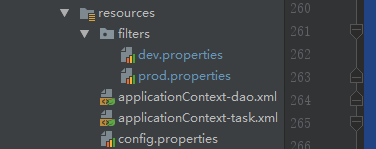
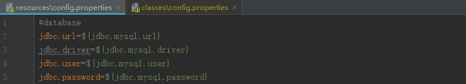
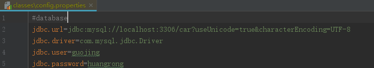

## 使用Maven 将项目分版

#### 前言

> 每个项目通常都会用不同的配置文件对应不同的版本，例如开发版和上线版本的配置通常会是不同的。此时就会产生一个问题，当项目需要从开发版切换到上线版时，总是会避免不了更改很多配置项，或者切换配置文件，但是不管哪一种都不方便配置。使用Maven就可以很方便的帮助我们应对这种问题，本文就简单介绍一下使用方法。

#### resources属性

> 这个属性就是指定构建项目时需要将哪些配置文件打包，其本身包含很多子标签，这里就不一一介绍了，只介绍相关的。其中**include**就是指定需要包含在最终项目中的资源。

```xml
 <resources>
            <resource>
                <directory>src/main/java</directory>
                <includes>
                    <include>**/*.xml</include>
                </includes>
            </resource>
            <resource>
                <directory>src/main/resources</directory>
                <filtering>true</filtering>
                <includes>
                    <include>*.properties</include>
                    <include>*.xml</include>
                </includes>
            </resource>
```

> 在上面的**resource**标签意思是将src/main/java/下的文件夹及其子文件夹的xml文件在编译时包含在最终工程中。**这个配置可以解决mybaits的将mapper接口和mapper.xml放在同一个文件夹下找不到mapper的问题**。
>
> 下面的**resource**标签是本文重点要介绍的。其含义是扫描src/main/resources/下的所有properties和xml文件将其中的${}引用在打包时换成直接引用。**filtering**标签的作用就是这个。

#### 示例



> 上图为本次示例的项目结构，dev.properties对应开发版配置，prod.properties对应上线版配置。

```properties
#prod.properties
#database
jdbc.mysql.url=jdbc:mysql://localhost:3306/car?useUnicode=true&characterEncoding=UTF-8
jdbc.mysql.driver=com.mysql.jdbc.Driver
jdbc.mysql.user=guojing
jdbc.mysql.password=huangrong
```

```properties
#config.properties
#database
jdbc.url=${jdbc.mysql.url}
jdbc.driver=${jdbc.mysql.driver}
jdbc.user=${jdbc.mysql.user}
jdbc.password=${jdbc.mysql.password}
```

##### 通过profile标签使上线版配置文件生效

```xml
<profiles>
        <profile>
            <id>dev</id>
            <build>
                <filters>
                    <filter>src/main/resources/filters/dev.properties</filter>
                </filters>
            </build>
        </profile>
        <profile>
            <id>prod</id>
          	<activation> <!-- 这里是关键，让这个版本默认激活 -->
                <activeByDefault>true</activeByDefault>
            </activation>
            <build>
                <filters>
                    <filter>src/main/resources/filters/prod.properties</filter>
                </filters>
            </build>
        </profile>
    </profiles>
```





> 设置完毕后可以通过ctrl加鼠标左键点击符号引用可以直接跳转到内容，编译后可以发现符号引用变成了实际内容，至此完成了使用Maven分版本开发配置。

