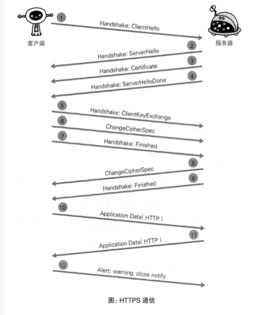

## Https 原理

https://www.cnblogs.com/zhangshitong/p/6478721.html

https://www.jianshu.com/p/55e402bcbc18

### 概括

> https的通信主要是两段加密的过程，客户端和服务端的通信要保证安全则需要使用密钥对传输内容进行加密。因为非对称加密算法的效率低所以采取对称加密算法。

### 问题提出

#### 1. 那么就出现了第一个问题:数据密钥怎么给客户端？

肯定是要加密的，那么用什么方法，对称加密算法吗，那么问题就来了，解密数据密钥的密钥怎么传给客户端？再设计一层嘛？所以行不通。那么就用非对称加密，服务端用私钥加密数据密钥，而客户端用自己的服务端发给他的公钥进行解密拿出数据密钥。

#### 2. 那么如果有个中间人是不是整个计划也就泡汤了？怎么防止这种情况?就是怎么保证我拿到的公钥是我想访问的服务器的公钥？

把公钥放到一个第三方权威机构，也就是CA中心。CA中心给服务器颁发权威证书，也就是CA中心把服务端需要获取数据密钥的公钥用自己的公钥加密后的东西(很绕。。)。CA中心的公钥就在操作系统或浏览器中可查。

#### 3. 那么即便证书是合法的也不能证明我和服务器之间就没有中间人啊，因为其他机构也可以注册证书?

这个时候就有一个数字签名的概念，在证书中还有一个数字签名，这个签名就像指纹，唯一确定一个服务器，通过特定方法加密过的，一起放在证书中。客户端通过验证数字签名的方式确定这是需要交互的客户端发来的证书。这样就终于拿到服务端的数据密钥的加密公钥了。然后客户端生成一个随机密钥，通过这个公钥加密，服务端解密后达成协议，后面的通信都用这个密钥进行通信，以打成通信安全的目的。

### 交互流程

> 1. 客户端通过发送client hello报文开始SSL通信.报文中包含客户端支持的SSL指定版本,加密组件列表(所使用的加密算法 密钥长度等)
> 2. 服务器可进行SSL通信时,会议Server Hello报文作文回应.报文中含SSL版本 加密组件.服务器的加密组件内容是从接受客户端加密组件内筛选出来的.
> 3. 之后服务器发送certificate报文.报文中包好公开密钥证书.
> 4. 服务器发送server hello done报文通知客户端.最初阶段握手协商部分结束.
> 5. SSL第一次握手结束后,客户端以client key exchange报文作为回应.报文包含通信加密中使用的随机密码串.该报文已用步骤3中的公钥加密;
> 6. 客户端继续发送change cipher spec报文.该报文会提示想服务器,在此报文之后的通讯会采用pre-master secret密钥加密
> 7. 客户端发送finished报文 该报文包含连接至今前部报文的整体校验值.这次握手协商是否成功,要以服务器是否能够正确解密该报文作文判定标准.
> 8. 服务器同样发送change cipher spec报文
> 9. 服务器同样发送finished报文
> 10. C&S finishe报文交换完毕之后,ssl连接就算建立完成.通信会受到SSL的保护.从此开始进行应用层的协议通信,即发送HTTP响应
> 11. 应用层协议通信,即发送HTTP响应
> 12. 最后客户端断开连接.断开连接时,发送close_notity报文.上图做了一些省略